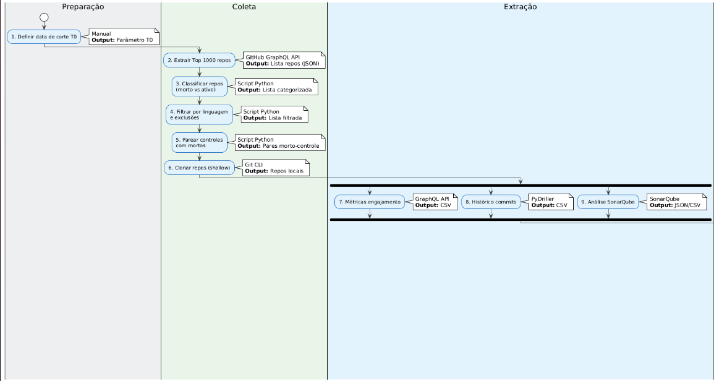
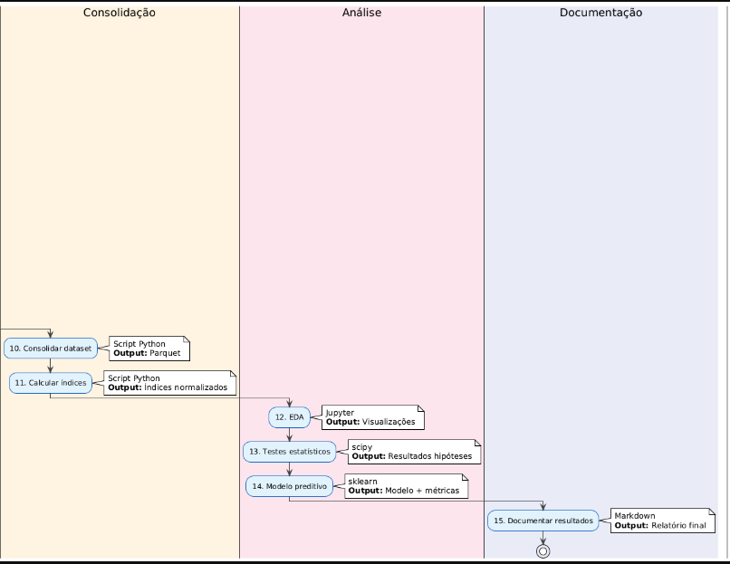

# Plano de Experimento – Scoping e Planejamento

## 1. Identificação básica

### 1.1 Título do experimento
Mapeando a Morte de Repositórios Open-Source: uma Análise Empírica sobre Engajamento, Atividades e Qualidade do Código

### 1.2 ID / código
GRAMOS1.0

### 1.3 Versão do documento e histórico de revisão
Tabela de versões e revisões:

| Versão | Data        | Descrição                                                                 |
|--------|-------------|---------------------------------------------------------------------------|
| v1.0   | 20/11/2025  | Primeira elaboração das seções 1 e 2 baseada na definição do tema e GQM. |

### 1.4 Datas (criação, última atualização)
| Item                                     | Valor                                      |
|------------------------------------------|--------------------------------------------|
| Data de criação                          | 20/11/2025                                 |
| Última atualização                       | 20/11/2025                                 |

### 1.5 Autores (nome, área, contato)
| Papel                       | Nome                          | Contato                                                     |
|----------------------------|-------------------------------|-------------------------------------------------------------|
| Autor principal            | Gabriel Ramos Ferreira         | gabriel.ferreira.732131@sga.pucminas.br |
| Revisor metodológico       | Danilo de Quadros Maia Filho  | 1514571@sga.pucminas.br

### 1.6 Responsável principal (PI / dono do experimento)

#### Gabriel Ramos Ferreira

**Responsabilidades:**

- Aderência metodológica
- Aprovar mudanças de escopo
- Validar instrumentos
- Assegurar integridade dos dados

### 1.7 Projeto / produto / iniciativa relacionada 

**Área de conhecimento:** Sustentabilidade e evolução de projetos open-source.  

**Projeto:** Potencial geração de dataset público reutilizável e metodologia para análise de risco de morte de repositórios.

**Benefícios esperados:** Orientar mantenedores sobre sinais precoces de morte e fomentar estudos subsequentes sobre o gerenciamneto de projetos para OSS.

## 2. Contexto e problema

### 2.1 Descrição do problema / oportunidade
Repositórios open-source populares são uma porcentagem muito pequena de projetos que obtiveram sucesso em seu gerenciamento sem nenhum tipo de investimento financeiro, que acaba tornando difícil sua manutenção. No entanto, seu sucesso não garante que eles não voltem a passar por períodos de baixa constribuição que podem levar à sua morte. Tanto a comunidade científica, quanto a comunidade open-source já tem conhecimento desse fenômeno, mas ainda existem lacunas na compreensão de como padrões de engajamento comunitário, atividades de desenvolvimento e qualidade do código interagem antes da morte. A oportunidade é caracterizar esses padrões e construir bases de dados que possibilitem a comparação para os projetos existentes e a detecção precoce dos padrões que levam à morte dos repositórios, apoiando manutenção e tomada de decisão.

### 2.2 Contexto organizacional e técnico
O experimento será realizado em contexto acadêmico de TCC utilização de dados públicos do GitHub.

**Ferramentas técnicas:** GitHub GraphQL API (metadados de issues, PRs, stars, forks), PyDriller (histórico de commits), SonarQube (qualidade estática), ambiente de análise Python (pandas, numpy, scipy, scikit-learn). 

**Processo:** pipeline reprodutível de coleta → transformação → análise estatística → modelagem preditiva. 

Dados tratados em nível de repositório sem identificação sensível de indivíduos.

### 2.3 Trabalhos e evidências prévias (internos e externos)
#### Evidências externas

[Dey & Mockus 2020](https://dl.acm.org/doi/10.1145/3382494.3410685), que justifica a morte considerada a partir de 180 dias de inatividade.

#### Evidências internas

No momento existem dados coletados pelo projeto de pesquisa de TI6 (se encontra privado no momento) relacionados à reativação de repositórios que morreram pelo período de 180 dias. No entanto, o foco dessa coleta foi apenas nos repositórios que se reativaram, o que já da um ponto de partida, com aqueles que apenas morreram sem se reativar.

### 2.4 Referencial teórico e empírico essencial

Referências ligadas aos três pilares (Engajamento, Atividades, Qualidade).

| Referência               | Pilar principal          | Achado relevante / Contribuição                        | Aplicação no Estudo                              |
|--------------------------|--------------------------|--------------------------------------------------------|--------------------------------------------------|
| [Serebrenik & Vasilescu 2019](https://arxiv.org/abs/1906.08058) | Engajamento/Atividade | Sinais precursores de abandono                         | Definição operacional de morte e sinais iniciais |
| [Kaur et. al. 2022](https://www.sciencedirect.com/science/article/pii/S1319157820305139?via%3Dihub)         | Engajamento             | Fatores de participação e retenção                     | Seleção de variáveis de engajamento              |
| [Steinmacher et al. 2021](https://arxiv.org/abs/2103.04656)  | Onboarding              | Diretrizes para entrada de novos contribuidores        | Interpretação do churn e retenção                |
| [Coelho et al. 2020](https://ieeexplore.ieee.org/document/6606589)       | Manutenção              | Tipos e métricas de manutenção                         | Classificação de commits/manutenção              |
| [Mockus et al. 2002](https://dl.acm.org/doi/10.1145/567793.567795)       | Dinâmica OSS            | Estrutura de papéis e contribuição                     | Modelagem de distribuição de esforço             |
| [Hilton et al. 2016](https://dl.acm.org/doi/10.1145/2970276.2970358)       | Engajamento/Qualidade   | Fatores que afetam aceitação de PR                     | Métricas de merge rate e tempo até merge         |
| [Ma et al. 2019](https://arxiv.org/abs/1908.09321)           | Qualidade/Engajamento   | Contribuição e qualidade influenciam aceitação de PR   | Conectar qualidade de código e throughput PR     |

## 3. Objetivos e questões (Goal / Question / Metric)

### 3.1 Objetivo geral

| Elemento      | Descrição                                                                 |
|---------------|--------------------------------------------------------------------------|
| Analisar      | Repositórios open-source populares que morreram                 |
| Propósito     | Compreender fatores associados à essa morte                   |
| Foco          | Sob os 3 pilares de engajamento, atividades de desenvolvimento e qualidade do código         |                                    |
| Contexto      | Top 1000 repositórios por estrelas no GitHub                             |

### 3.2 Objetivos específicos

| ID  | Objetivo                                                                                      |
|-----|-----------------------------------------------------------------------------------------------|
| 1  | Caracterizar padrões de engajamento (issues, PRs, interações) no período pré-morte          |
| 2  | Identificar mudanças em atividades de desenvolvimento (commits, releases, churn) pré-morte   |
| 3  | Avaliar indicadores de qualidade (complexidade, smells, dívida técnica) pré-morte    |
| 4  | Determinar combinações de métricas dos três pilares que melhor explicam a probabilidade de morte |
| 5  | Construir e validar (por meio de técnicas de machine learning) um modelo preditivo de risco de morte com antecedência, de acordo com a análise dos 3 pilares       |

### 3.3 Questões

| ID  | Questão                                                                                                     |
|-----|-------------------------------------------------------------------------------------------------------------|
| RQ1 | Quais padrões de engajamento (issues, PRs, interação) são encontrados no período pré-morte de repositórios populares?          |
| RQ2 | Quais mudanças nas atividades de desenvolvimento (frequência de commits, releases, churn) são encontrados pré-morte? |
| RQ3 | Quais indicadores de qualidade de código (complexidade, smells, dívida técnica) se degradam ou estabilizam antes da morte? |
| RQ4 | Quais combinações de métricas dos três pilares explicam melhor a probabilidade de morte?                    |
| RQ5 | É possível prever a morte com antecedência (dias ou meses) usando um modelo baseado em métricas históricas correlacionadas?  |

### 3.4 Métricas

| RQ  | Métrica                          | Definição                                      | Unidade          | Fonte              |
|-----|----------------------------------|------------------------------------------------|------------------|--------------------| 
| RQ1 | Issues abertas/mês               | Quantidade de issues abertas por mês           | count/mês        | GitHub GraphQL API |
| RQ1 | Issues fechadas/mês              | Quantidade de issues fechadas por mês          | count/mês        | GitHub GraphQL API |
| RQ1 | Taxa de Merge                       | PRs mergeados / PRs abertos                    | porcentagem            | GitHub GraphQL API |
| RQ1 | Tempo até merge                  | Dias entre abertura e merge do PR              | dias             | GitHub GraphQL API |
| RQ1 | Comentários/PR                   | Média de comentários por PR                    | count            | GitHub GraphQL API |
| RQ1 | Delta de estrelas/mês               | Variação mensal de estrelas                    | count/mês        | GitHub GraphQL API |
| RQ2 | Commits/mês                      | Quantidade de commits por mês                  | count/mês        | PyDriller          |
| RQ2 | Gaps entre commits               | Dias máximos entre commits consecutivos        | dias             | PyDriller          |
| RQ2 | Releases/mês                     | Quantidade de releases por mês                 | count/mês        | GitHub GraphQL API |
| RQ2 | Churn de contribuidores          | (Novos − Saídas) / Total no período            | porcentagem            | PyDriller          |
| RQ2 | Bus factor                       | % commits dos top 2 autores                    | %                | PyDriller          |
| RQ3 | Densidade de smells              | Code smells / KLOC                             | smells/KLOC      | SonarQube          |
| RQ3 | Complexidade ciclomática média   | Média por função                         | Complex. Ciclomática               | SonarQube          |
| RQ3 | Dívida técnica                   | Minutos estimados de correção / KLOC           | min/KLOC         | SonarQube          |
| RQ3 | % Duplicação                     | Linhas duplicadas / LOC total                  | %                | SonarQube          |
| RQ4 | Índice de Engajamento     | score das métricas da RQ1            | score            | Calculado          |
| RQ4 | Índice de Atividade       | score normalizado de métricas da RQ2            | score            | Calculado          |
| RQ4 | Índice de Qualidade       | score normalizado de métricas da RQ3  | score            | Calculado          |
| RQ5 | AUC-ROC*                          | Área sob curva ROC do modelo preditivo         | 0–1              | sklearn            |
| RQ5 | F1-Score*                         | Média harmônica de precisão e recall           | 0–1              | sklearn            |

*A escolha das métricas da RQ5, foi feita de acordo com o que a biblioteca disponibiliza e a necessidade do trabalho em garantir um modelo de previsão mais preciso e equilibrado.

## 4. Escopo e contexto do experimento

### 4.1 Escopo funcional / de processo (incluído e excluído)

**Incluído:**
- Repositórios do Top 1000 por estrelas no GitHub (data de corte T0).
- Linguagens com suporte a SonarQube: JavaScript, TypeScript, Python, Java, Go, C#.
- Janela temporal: 12 meses anteriores à data de corte para séries históricas.
- Métricas de engajamento, atividade e qualidade conforme seção 3.4.
- Repositórios classificados como mortos (>180 dias sem commits) e controles ativos pareados.

**Excluído:**
- Repositórios explicitamente arquivados pelo proprietário.
- Forks sem desenvolvimento próprio significativo.
- Linguagens sem suporte adequado no SonarQube.
- Análise de discussões externas (Discord, Slack, fóruns) — fora do escopo de coleta.

### 4.2 Contexto do estudo (tipo de organização, projeto, experiência)

| Dimensão               | Descrição                                                                 |
|------------------------|--------------------------------------------------------------------------|
| Tipo de organização    | Acadêmico (TCC em Engenharia de Software – PUC Minas)                    |
| Tipo de projeto        | Pesquisa empírica observacional (mineração de repositórios)              |
| Criticidade            | Baixa                 |

### 4.3 Premissas

1. A API GraphQL do GitHub permanecerá disponível e com rate limits suficientes durante a coleta.
2. Os repositórios selecionados estarão acessíveis publicamente.
3. O SonarQube conseguirá analisar a maioria dos repositórios nas linguagens escolhidas.
4. Existem repositórios nos top 1000 do Github que estão a mais de 180 dias sem commits.
5. Métricas coletadas via PyDriller refletem fielmente o histórico de commits.

### 4.4 Restrições

| Tipo          | Descrição                                                                 |
|---------------|--------------------------------------------------------------------------|
| Tempo         | Prazo de TCC limita escopo a 6 meses de execução                        |
| Orçamento     | Uso de ferramentas gratuitas/open-source                     |
| Infraestrutura| Execução local    |
| Rate limits   | API GitHub: 5.000 req/hora pode exigir pausas na coleta   |
| Armazenamento | Clonagem de repositórios limitada pelo espaço de armazenamento

### 4.5 Limitações previstas

- **Generalização restrita:** Resultados aplicam-se a repositórios muito populares (Top 1000); projetos menores podem ter dinâmicas distintas.
- **Viés de linguagem:** Foco em linguagens com suporte SonarQube pode excluir ecossistemas relevantes (Rust, Kotlin).
- **Definição de morte:** Janela de 180 dias pode incluir projetos com ciclos de release longos.
- **Qualidade de métricas:** SonarQube pode não detectar todos os tipos de dívida técnica. Além disso a cobertura de testes depende de configuração do repositório.
- **Snapshot temporal:** Coleta em data única (T0) pode não refletir variações sazonais ou eventos pontuais.

## 5. Stakeholders e impacto esperado

### 5.1 Stakeholders principais

| Stakeholder                      | Papel / Interesse                                                      |
|----------------------------------|---------------------------------------------------------------
| Comunidade científica   | Consumo de resultados, replicação e extensão                           |
| Mantenedores de projetos OSS     | Uso de insights para monitorar saúde de repositórios                   |
| Plataformas (GitHub)             | Potencial uso de métricas para features de alerta de inatividade       |

### 5.2 Interesses e expectativas dos stakeholders

| Stakeholder                      | Expectativa                                                            |
|----------------------------------|------------------------------------------------------------------------|
| Comunidade científica            | Dataset aberto, modelo replicável e evidências estatísticas robustas    |
| Mantenedores OSS                 | Indicadores práticos de risco e  recomendações acionáveis                |
| Plataformas                      | Validação de métricas que possam alimentar dashboards de saúde de repos|

### 5.3 Impactos potenciais no processo / produto

- **Positivos:** Geração de dataset público, com metodologia reprodutível e modelo preditivo disponível para a comunidade.
- **Neutros:** Estudo observacional não interfere em repositórios analisados.
- **Riscos:** Possível sobrecarga de requisições à API (mitigado por rate-limiting) e tempo de processamento do SonarQube pode atrasar cronograma.

## 6. Riscos de alto nível, premissas e critérios de sucesso

### 6.1 Riscos de alto nível (negócio, técnicos, etc.)

| ID  | Risco                                      | Probabilidade | Impacto | Mitigação                                      |
|-----|--------------------------------------------|---------------|---------|------------------------------------------------|
| R1  | API GitHub indisponível ou rate-limited    | Média         | Alto    | Implementar retries, cache e coleta em lotes   |
| R2  | Poucos repositórios mortos no Top 1000     | Média         | Alto    | Expandir para Top 2000 se necessário           |
| R3  | SonarQube falha em repositórios grandes    | Média         | Médio   | Limitar análise a subconjunto de arquivos      |
| R4  | Espaço em disco insuficiente               | Baixa         | Médio   | Clonar shallow e limpar após extração          |
| R5  | Prazo de TCC insuficiente                  | Média         | Alto    | Priorizar RQs 1–3, deixando o modelo preditivo como extra |

### 6.2 Critérios de sucesso globais (go / no-go)

| Critério                                                        | Limiar mínimo                              |
|-----------------------------------------------------------------|--------------------------------------------|
| Quantidade de repositórios mortos identificados                 | ≥ 30 repositórios                          |
| Cobertura de métricas (% repositórios com dados completos)      | ≥ 80%                                      |

### 6.3 Critérios de parada antecipada (pré-execução)

- **Menos de 20 repositórios mortos** encontrados no Top 1000 após filtragem → reavaliar escopo ou expandir universo.
- **API GitHub com bloqueio prolongado** (>7 dias) → buscar alternativas (GH Archive, dataset público).
- **Mudança nos Termos de Serviço do GitHub** que impeça mineração

## 7. Modelo conceitual e hipóteses

### 7.1 Modelo conceitual do experimento
O modelo conceitual do experimento considera que a morte dos repositórios é influenciada por três pilares principais: 

- **Engajamento da comunidade**: A redução na abertura e fechamento de issues, na interação em pull requests e no crescimento de estrelas pode indicar perda de interesse da comunidade.
- **Atividades de desenvolvimento**: Diminuição na frequência de commits, aumento nos gaps entre commits e redução no número de releases podem significar que está havendo um esforço de manutenção.
- **Qualidade do código**: Aumento na densidade de code smells, complexidade e dívida técnica pode indicar a degradação técnica que desestimula contribuições enquanto aumenta as issues.

### 7.2 Hipóteses formais (H0, H1)
As hipóteses são formuladas para cada pilar:

- **Engajamento**:
  - H0E1: Não há diferença significativa na razão de issues abertas/fechadas nos últimos 90 dias pré-morte versus controles ativos.
  - H1E1: Há diferença significativa (menor fechamento ou menor abertura) nessa razão nos repositórios mortos.

- **Atividades de desenvolvimento**:
  - H0A1: A frequência média de commits/mês nos 3 últimos meses pré-morte não difere de controles ativos pareados.
  - H1A1: Repositórios mortos apresentam queda significativa na frequência de commits.

- **Qualidade do código**:
  - H0Q1: Métricas de complexidade média (ex.: complexidade ciclomática por função) não diferem entre mortos e ativos.
  - H1Q1: Repositórios mortos exibem aumento de complexidade ou pull-requests de refatorações que nunca são aprovados.

### 7.3 Nível de significância e considerações de poder
O nível de significância adotado será α = 0,05. O poder estatístico será avaliado para garantir que o tamanho amostral seja suficiente para detectar diferenças significativas.

## 8. Variáveis, fatores, tratamentos e objetos de estudo

### 8.1 Objetos de estudo
Os objetos de estudo são repositórios open-source populares (Top 1000 por estrelas no GitHub) classificados como "mortos" (sem commits por >180 dias) e seus controles ativos pareados.

### 8.2 Sujeitos / participantes (visão geral)
Os participantes indiretos são os mantenedores e contribuidores dos repositórios analisados visto que os dados são públicos e coletados de repositórios GitHub.

### 8.3 Variáveis independentes (fatores) e seus níveis
- **Status de morte**: Morto (1) ou ativo (0).
- **Linguagem principal**: JavaScript, Python, Java, Go, C#, TypeScript.
- **Idade do projeto**: Dias desde o primeiro commit.
- **Tamanho**: LOC total, número de arquivos.

### 8.4 Tratamentos (condições experimentais)
- **Grupo controle**: Repositórios ativos pareados em relação à tamanho com os mortos.
- **Grupo experimental**: Repositórios classificados como mortos.

### 8.5 Variáveis dependentes (respostas)
- **Engajamento**: Issues abertas/fechadas, taxa de merge, comentários por PR.
- **Atividades**: Commits/mês, releases/mês, churn de contribuidores.
- **Qualidade**: Densidade de code smells, complexidade ciclomática, dívida técnica.

### 8.6 Variáveis de controle / bloqueio
- **Linguagem**: Controlada para evitar viés de ecossistema.
- **Tamanho do repositório**: Pareamento por LOC.
- **Idade do repositório**: Pareamento por tempo desde o primeiro commit.

### 8.7 Possíveis variáveis de confusão conhecidas
- **Mudança de mantenedores**: Pode afetar engajamento e atividades.
- **Eventos externos**: Ex.: mudanças na comunidade, no ecossistema, ou até mesmo venda do produto para uma iniciativa privada.

## 9. Desenho experimental

### 9.1 Tipo de desenho (completamente randomizado, blocos, fatorial, etc.)
O desenho será observacional com pareamento entre repositórios mortos e controles ativos. O pareamento será realizado por linguagem, tamanho, idade e popularidade (estrelas).

### 9.2 Randomização e alocação
Não se aplica randomização, pois o estudo é observacional. O pareamento será feito para minimizar viés de seleção.

### 9.3 Balanceamento e contrabalanço
O balanceamento será garantido pelo pareamento de controles ativos com características similares aos repositórios mortos. Não há necessidade de contrabalanço, pois não há ordem de tratamentos.

### 9.4 Número de grupos e sessões
Haverá dois grupos principais:
- **Grupo experimental**: Repositórios mortos (>180 dias sem commits).
- **Grupo controle**: Repositórios ativos pareados.

Cada grupo será analisado em uma única sessão de coleta e análise.

## 10. População, sujeitos e amostragem

### 10.1 População-alvo
A população-alvo são repositórios open-source hospedados no GitHub que atingiram popularidade significativa (medida por estrelas), mas que apesar de terem alcançado sucesso inicial, morreram.

### 10.2 Critérios de inclusão de repositórios
- Pertencer ao Top 1000 repositórios por número de estrelas no GitHub na data de corte T0.
- Linguagem principal com suporte adequado no SonarQube (JavaScript, TypeScript, Python, Java, Go, C#).
- Repositório público e acessível para clonagem.
- Histórico de commits disponível para os 12 meses anteriores a T0.
- Para grupo morto: sem commits no branch principal por >180 dias consecutivos.
- Para grupo controle: pelo menos 1 commit nos últimos 30 dias.

### 10.3 Critérios de exclusão de repositórios
- Repositórios arquivados.
- Forks.
- Repositórios de documentação.
- Repositórios com commits corrompidos.

### 10.4 Tamanho da amostra planejado (por grupo)
| Grupo                | Tamanho esperado | Justificativa                                      |
|----------------------|------------------|----------------------------------------------------|
| Repositórios mortos  | ≥ 30             | Mínimo para análises estatísticas robustas         |
| Repositórios ativos (controle) | 30–60  | Relação 1:1 ou 1:2 com mortos                   |
| **Total estimado**   | 60–90            | Balanceado estatístico         |

Caso o Top 1000 não forneça ≥30 repositórios mortos, o universo será expandido para Top 5000.

### 10.5 Método de seleção / recrutamento
1. **Extração inicial:** Query GraphQL para obter Top 1000 repositórios ordenados por estrelas.
2. **Classificação:** Script automatizado para identificar repositórios mortos (>180 dias sem commits).
3. **Pareamento:** Para cada repositório morto, serão selecionados 1–2 controles ativos pareados por:
   - Linguagem principal (exata)
   - Faixa de estrelas (±10%)
   - Idade do repositório (±1 ano)
   - Tamanho aproximado (LOC ±20%)

### 10.6 Treinamento e preparação dos sujeitos
Não aplicável. O estudo é observacional e os "sujeitos" são repositórios de software. A preparação consiste na configuração do pipeline de coleta e análise.

## 11. Instrumentação e protocolo operacional

### 11.1 Instrumentos de coleta (questionários, logs, planilhas, etc.)

| Instrumento                  | Tipo           | Descrição / Papel                                              |
|------------------------------|----------------|----------------------------------------------------------------|
| GitHub GraphQL API           | API            | Coleta de metadados: issues, PRs, stars, forks, releases       |
| PyDriller                    | Biblioteca Python | Extração de histórico de commits, autores, diffs, churn     |
| SonarQube (Community Edition)| Ferramenta     | Análise estática: smells, complexidade, dívida técnica         |
| Scripts Python        | Scripts        | Transformação e normalização de métricas         |
| Planilha de rastreamento     | Excel      | Controle de repositórios processados, status e erros           |
| Arquivo de configuração de ambiente      | JSON      | Parâmetros do experimento (data T0, thresholds, linguagens)    |
| Logs de execução             | Arquivos .log  | Registro de erros, warnings e progresso do pipeline            |

### 11.2 Materiais de suporte (instruções, guias)
- **README do repositório:** Instruções para configurar ambiente e executar pipeline.
- **Documentação de métricas:** Definição de cada métrica coletada.
- **Checklist de validação:** Verificação de integridade dos dados coletados.

### 11.3 Procedimento experimental (protocolo – visão passo a passo)

### 11.4 Plano de piloto (se haverá piloto, escopo e critérios de ajuste)

**Haverá piloto:** Sim

| Aspecto              | Descrição                                                      |
|----------------------|----------------------------------------------------------------|
| Escopo               | Top 100 repositórios (subconjunto do universo)                 |
| Objetivo             | Validar pipeline, identificar gargalos e ajustar thresholds    |
| Duração estimada     | 1–2 semanas                                                    |
| Critérios de ajuste  | Ajustar rate limits, revisar critérios de exclusão, calibrar SonarQube |
| Decisão go/no-go     | Piloto bem-sucedido se ≥5 repositórios mortos identificados e processados |

## 12. Plano de análise de dados (pré-execução)

### 12.1 Estratégia geral de análise (como responderá às questões)

| RQ  | Estratégia de análise                                                                 |
|-----|--------------------------------------------------------------------------------------|
| RQ1 | Estatística descritiva (média, mediana, desvio padrão) e comparação entre grupos (mortos vs ativos) para métricas de engajamento. Visualização com boxplots e gráficos de linha. |
| RQ2 | Análise descritiva de commits, releases e churn. Comparação de medianas entre grupos. Gráficos de tendência temporal. |
| RQ3 | Comparação de métricas de qualidade (smells, complexidade, dívida) entre grupos. Análise de correlação entre métricas. |
| RQ4 | Correlação entre métricas dos três pilares e status de morte. Identificação das métricas mais associadas à morte. |
| RQ5 | Treinamento de modelo de classificação (Random Forest). Avaliação por AUC-ROC e F1-Score. |

### 12.2 Métodos estatísticos planejados

| Tipo de análise              | Método                                      | Aplicação                                  |
|------------------------------|---------------------------------------------|--------------------------------------------|
| Estatística descritiva       | Média, mediana, desvio padrão, quartis      | Caracterizar cada métrica por grupo        |
| Comparação de 2 grupos       | Mann-Whitney U                              | Comparar mortos vs ativos (não-paramétrico)|
| Correlação                   | Spearman                                    | Associação entre métricas contínuas        |
| Classificação (ML)           | Regressão Logística                               | Modelo preditivo de morte                  |

### 12.3 Tratamento de dados faltantes e outliers

**Dados faltantes:**
- Repositórios com muitas métricas ausentes (>30%): exclusão do repositório.
- Para variáveis com poucos valores ausentes: imputação pela mediana do grupo.

**Outliers:**
- Identificação visual por boxplots.
- Documentar outliers identificados e decidir caso a caso se devem ser mantidos ou removidos.

### 12.4 Plano de análise para dados qualitativos (se houver)
O estudo é predominantemente quantitativo. Não há coleta sistemática de dados qualitativos.

## 13. Avaliação de validade (ameaças e mitigação)

### 13.1 Validade de conclusão
Liste ameaças que podem comprometer a robustez das conclusões estatísticas (baixo poder, violação de suposições, erros de medida) e como pretende mitigá-las.

### 13.2 Validade interna
Identifique ameaças relacionadas a causas alternativas para os efeitos observados (history, maturation, selection, etc.) e explique suas estratégias de controle.

### 13.3 Validade de constructo
Reflita se as medidas escolhidas realmente representam os conceitos de interesse e descreva como você reduzirá ambiguidades de interpretação.

### 13.4 Validade externa
Discuta em que contextos os resultados podem ser generalizados e quais diferenças de cenário podem limitar essa generalização.

### 13.5 Resumo das principais ameaças e estratégias de mitigação
Faça uma síntese das ameaças mais críticas e das ações planejadas, de preferência em forma de lista ou tabela simples.

## 14. Ética, privacidade e conformidade

### 14.1 Questões éticas (uso de sujeitos, incentivos, etc.)
Descreva potenciais questões éticas (pressão para participar, uso de estudantes, incentivos, riscos de exposição) e como serão tratadas.

### 14.2 Consentimento informado
Explique como os participantes serão informados sobre objetivos, riscos, benefícios e como registrarão seu consentimento.

### 14.3 Privacidade e proteção de dados
Indique que dados pessoais serão coletados, como serão protegidos (anonimização, pseudoanonimização, controle de acesso) e por quanto tempo serão mantidos.

### 14.4 Aprovações necessárias (comitê de ética, jurídico, DPO, etc.)
Liste órgãos ou pessoas que precisam aprovar o experimento (comitê de ética, jurídico, DPO, gestores) e o status atual dessas aprovações.

## 15. Recursos, infraestrutura e orçamento

### 15.1 Recursos humanos e papéis
Identifique os membros da equipe do experimento e descreva brevemente o papel e responsabilidade de cada um.

### 15.2 Infraestrutura técnica necessária
Liste ambientes, servidores, ferramentas, repositórios e integrações que devem estar disponíveis para executar o experimento.

### 15.3 Materiais e insumos
Relacione materiais físicos ou digitais necessários (máquinas, licenças, formulários, dispositivos) que precisam estar prontos antes da operação.

### 15.4 Orçamento e custos estimados
Faça uma estimativa dos principais custos envolvidos (horas de pessoas, serviços, licenças, infraestrutura) e a fonte de financiamento.

## 16. Cronograma, marcos e riscos operacionais

### 16.1 Macrocronograma (até o início da execução)
Defina as principais datas e marcos (conclusão do plano, piloto, revisão, início da operação) com uma visão de tempo realista.

### 16.2 Dependências entre atividades
Indique quais atividades dependem de outras para começar (por exemplo, treinamento após aprovação ética), deixando essas dependências claras.

### 16.3 Riscos operacionais e plano de contingência
Liste riscos ligados a cronograma, disponibilidade de pessoas ou recursos, e descreva ações de contingência caso esses riscos se materializem.

## 17. Governança do experimento

### 17.1 Papéis e responsabilidades formais
Defina quem decide, quem executa, quem revisa e quem apenas deve ser informado, deixando claro o fluxo de responsabilidade.

### 17.2 Ritos de acompanhamento pré-execução
Descreva as reuniões, checkpoints e revisões previstos antes da execução, incluindo frequência e participantes.

### 17.3 Processo de controle de mudanças no plano
Explique como mudanças no desenho ou no escopo do experimento serão propostas, analisadas, aprovadas e registradas.

## 18. Plano de documentação e reprodutibilidade

### 18.1 Repositórios e convenções de nomeação
Indique onde o plano, instrumentos, scripts e dados (futuros) serão armazenados e quais convenções de nomes serão usadas.

### 18.2 Templates e artefatos padrão
Liste os modelos (questionários, formulários, checklists, scripts) que serão usados e onde podem ser encontrados.

### 18.3 Plano de empacotamento para replicação futura
Descreva o que será organizado desde já (documentos, scripts, instruções) para facilitar a replicação do experimento por outras equipes ou no futuro.

## 19. Plano de comunicação

### 19.1 Públicos e mensagens-chave pré-execução
Liste os grupos que precisam ser comunicados e quais mensagens principais devem receber (objetivos, escopo, datas, impactos esperados).

### 19.2 Canais e frequência de comunicação
Defina por quais canais (e-mail, reuniões, Slack/Teams, etc.) e com que frequência as comunicações serão feitas.

### 19.3 Pontos de comunicação obrigatórios
Especifique os eventos que exigem comunicação formal (aprovação do plano, mudanças relevantes, adiamentos, cancelamentos).

## 20. Critérios de prontidão para execução (Definition of Ready)

### 20.1 Checklist de prontidão (itens que devem estar completos)
Liste os itens que precisam estar finalizados e aprovados (plano, instrumentos, aprovação ética, recursos, comunicação) para autorizar o início da operação.

### 20.2 Aprovações finais para iniciar a operação
Indique quem precisa dar o "ok final" (nomes ou cargos) e como esse aceite será registrado antes da execução começar.
